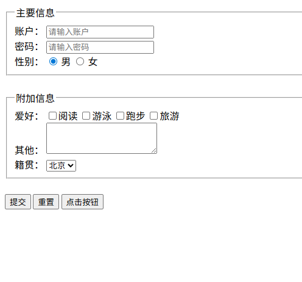
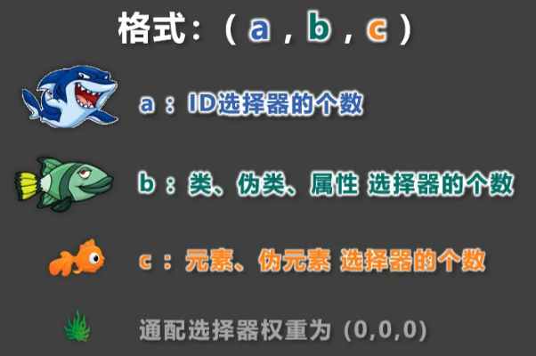
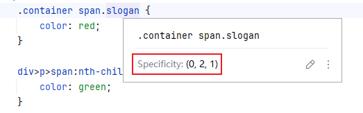
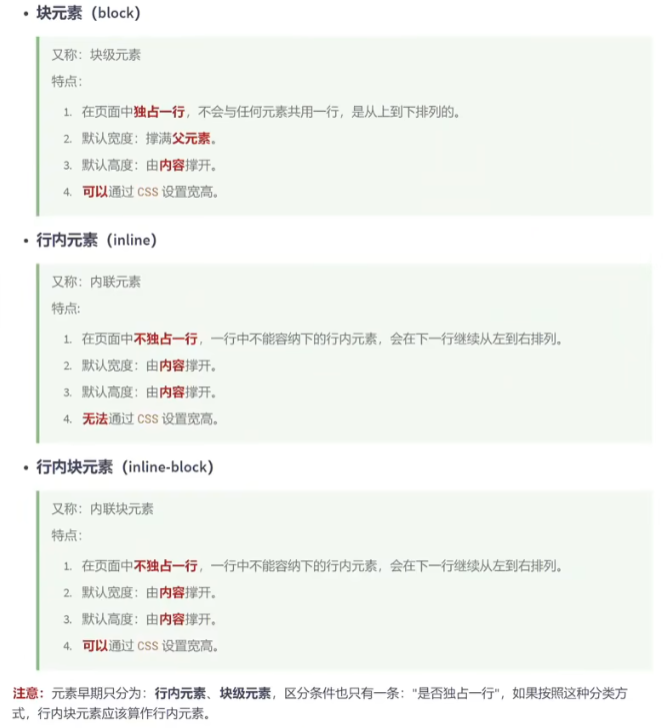
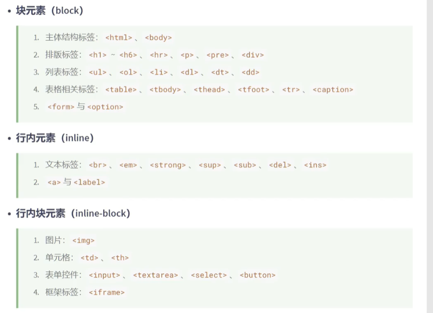

# 我的前端学习笔记


## HTML4

HTML标签参考文档：[官方文档](https://html.spec.whatwg.org/multipage/#toc-semantics) 、[w3school](https://www.w3school.com.cn/) 、[MDN](https://developer.mozilla.org/zh-CN/docs/Web/HTML)

**fieldset**标签与**legend**标签：

```html
<!doctype html>
<html lang="en">
<head>
    <meta charset="UTF-8">
    <title>Index</title>
</head>
<body>
<form action="http://localhost:8080/submit">
    <!--主要信息-->
    <fieldset>
        <legend>主要信息</legend>
        <label for="account">账户：</label>
        <input type="text" name="account" id="account" placeholder="请输入账户" maxlength="10">
        <br>
        <label for="password">密码：</label>
        <input type="password" name="password" id="password" placeholder="请输入密码" maxlength="6">
        <br>
        性别：
        <input type="radio" name="gender" id="male" value="male" checked>
        <label for="male">男</label>
        <input type="radio" name="gender" id="female" value="female">
        <label for="female">女</label>
    </fieldset>
    <br>
    <!--附加信息-->
    <fieldset>
        <legend>附加信息</legend>
        爱好：
        <label>
            <input type="checkbox" name="hobby" value="reading">阅读
        </label>
        <label>
            <input type="checkbox" name="hobby" value="swimming">游泳
        </label>
        <label>
            <input type="checkbox" name="hobby" value="running">跑步
        </label>
        <label>
            <input type="checkbox" name="hobby" value="traveling">旅游
        </label>
        <br>
        <label for="other"> 其他： </label>
        <textarea name="other" id="other" cols="23" rows="3"></textarea>
        <br>
        <label for="hometown">籍贯：</label>
        <select name="hometown" id="hometown">
            <option value="beijing">北京</option>
            <option value="shanghai">上海</option>
            <option value="guangzhou">广州</option>
            <option value="shenzhen">深圳</option>
        </select>
    </fieldset>
    <br>
    <input type="submit" value="提交">
    <input type="reset" value="重置">
    <input type="button" value="点击按钮">
</form>
</body>
</html>
```

效果如下




## CSS2

CSS：层叠样式表

样式表及其优先级：行内样式 <span style="color:red;">**>**</span> 内部样式 <span style="color:red;">**=**</span> 外部样式

### 选择器

#### 基本选择器

```css
/*通配选择器*/
* {}

/*元素选择器*/
div {}

/*类选择器*/
.class {}

/*id选择器*/
#id {}
```

#### 复合选择器

```css
/*交集选择器*/
p.beauty {
    color: red;
}

/*并集选择器*/
.dog, .pig, #susie {
    color: orange;
}

/*后代选择器*/
ul li {
    color: red;
}

/*子元素选择器*/
div > a {
    color: green;
}

/*相邻兄弟选择器*/
span + p {
    font-size: 20px;
}

/*通用兄弟选择器*/
span ~ p {
    color: red;
}

/*属性选择器*/
[title] { /*含title属性的元素*/
    font-size: 40px;
}
[title="stone1"] { /*含title属性且值为stone1的元素*/
    background-color: pink;
}
[title^="stone"] { /*含title属性且值以stone开头的元素*/
    color: blue;
}
[title$="2"] { /*含title属性且值以2结尾的元素*/
    color: green;
}
[title*="pstone"] { /*含title属性且值包含pstone的元素*/
    color: red;
}
```

#### 伪类选择器

```css
/*选中未被访问过的a元素*/
a:link {
    font-size: 20px;
    color: orange;
}

/*选中已被访问过的a元素*/
a:visited {
    color: gray;
}
```

**动态伪类**

```css
/*选中鼠标悬停的a元素*/
a:hover {
    color: skyblue;
}

/*选中鼠标点击的a元素*/
a:active {
    color: green;
}

/*获取焦点元素*/
input:focus, select:focus {
    color: orange;
    background-color: green;
}
```

<span style="color:red;">上面四个动态伪类的书写顺序：**link** > **visited** > **hover** > **active**</span>

**结构伪类**

<span style="color:red;">重点6个伪类选择器</span>

```css
div > p:first-child {}
div > p:last-child {}
div > p:nth-child(2n) {}

div > p:first-of-type {}
div > p:last-of-type {}
div > p:nth-of-type(2n+1) {}
```

其他伪类

```css
div > p:nth-last-child(2n) {}
div > p:nth-last-of-type(2n+1) {}

span:only-child {}
span:only-of-type {}

:root {}
div:empty {}
```

**否定伪类**

```css
div > p:not(.fail) {}
div > p:not([title^="你要"]) {}
div > p:not(:first-child) {}
```

**UI伪类**

```css
input:checked {}
input:enabled {}
input:disabled {}
```

**目标伪类**

```css
div:target {}
```

**语言伪类**

```css
div:lang(en) {}
div:lang(zh-CN) {}
:lang(zh-CN) {}
```

#### 伪元素选择器

```css
div::first-latter {}
div::first-line {}
div::selection {}
input::placeholder {}
p::before { content: "$" }
p::after { content: "美元" }
```

#### 选择器优先级

<b style="color:red;">行内样式 > ID选择器 > 类选择器 > 元素选择器 > 通配选择器</b>

<b style="color:orange;">组合选择器的权重计算方式：</b>



通过WebStorm查看组合选择器的权重：



<span style="color:purple;">关键字`!important`可以将属性的优先级提到最前面！！！</span>

```css
.slogan {
    color: darkred !important;
}
```


### CSS三大特性

**层叠性**：如果发生了样式冲突，那就会根据一定的规则（选择器优先级），进行样式的层叠（覆盖）。

> 样式冲突：元素的同一个样式名，被设置了不同的值，这就是冲突

**继承性**：元素会自动拥有其父元素、或其祖先元素上所设置的某些样式。

> 规则：就近原则
>
> 常见的可继承属性：text-?? 、line-?? 、color ......
>
> 备注：在MDN网站，可以查询属性是否可以被继承

**优先级**：`!important` > 行内样式 > ID选择器 > 类选择器 > 元素选择器 > `*` >  继承的样式

>需要计算权重，并集选择器的每一个部分都是分开算的


### 常用CSS属性

#### 字体属性

```css
span {
    /*Chrome浏览器默认支持的最小文字大小为12px，默认的文字大小为16px，并且0px的文字会自动消失*/
    font-size: 40px;
    /*字体族*/
    font-family: "微软雅黑";
    /*控制字体是否倾斜*/
    font-style: normal;
    /*控制字体粗细*/
    font-weight: normal;
    
    /*字体的复合属性*/
    font: italic bold 20px 'Times New Roman';
}
```

#### 文本属性

```css
div {
    color: yellow;
    background-color: purple;
    /*控制字符间距*/
    letter-spacing: 10px;
    /*控制单词间距（对中文词汇不生效）*/
    word-spacing: 20px;
    /*下划线*/
    text-decoration: underline wavy red;
    /*首行缩进2字符*/
    text-indent: 2em;
    /*文本居中*/
    text-align: center;
    /*设置文本行高
    注意事项：
    1.line-height不宜过小，一般是font-size的1.5-2倍
    2.line-height是可以继承的
    3.line-height与height的关系：若没设置height，则height=line-height*行数
    应用场景：
    1.让单行文本垂直居中
    2.调整多行文字的间距
    */
    line-height: 100px;
    /*vertical-align属性：用于控制元素在行内的垂直对齐方式（可以控制表格单元格内容的垂直对齐）*/
    vertical-align: middle;
}
```

#### 列表属性

```css
ul {
    /*去除列表项前面的符号*/
    list-style-type: disc;
    /*设置列表项的“项目符号”是放在列表项内容的“内部”还是“外部”*/
    list-style-position: outside;
    /*设置列表项的“项目符号”的样式*/
    list-style-image: url("images/1.png");
    /*复合属性*/
    list-style: url("images/1.png") inside;
}
```

#### 表格属性

```css
table {
    border-width: 2px;
    border-style: solid;
    border-color: red;
    /*边框复合属性*/
    border: 2px solid red;
    /*控制表格的列宽*/
    table-layout: auto;
    /*控制单元格间距（生效的前提是：不能合并边框）*/
    border-spacing: 2px;
    /*控制单元格边框合并*/
    border-collapse: collapse;
    /*隐藏没有内容的单元格（生效的前提是：不能合并边框）*/
    empty-cells: hide;
    /*设置表格标题的位置*/
    caption-side: bottom;
}
```

#### 背景属性

```css
div {
    /*背景色*/
    background-color: transparent;
    /*背景图片*/
    background-image: url("images/1.jpg");
    /*背景图片是否重复*/
    background-repeat: no-repeat;
    /*背景图片位置*/
    background-position: center top;
    /*复合属性*/
    background: transparent url("images/1.jpg") no-repeat center top 100% 100% fixed border-box padding-box;
}
```

#### 鼠标属性

```css
div {
    /*鼠标样式*/
    cursor: pointer;
    /*自定义鼠标图标*/
    cursor: url("images/1.png"), pointer;
}
```


### 常用的长度单位

```css
div {
    width: 200px;
    height: 200px;
    font-size: 20px;
    background-color: skyblue;
    /*px*/
    /*em：相当于当前元素的font-size的倍数（当前元素没有font-size时，以其父元素为准）*/
    /*rem：相当于根元素的font-size的倍数*/
    /*%：相对其父元素的百分比*/
}
```


### 元素的显示模式



---



**如何修改元素的显示模式？**

```css
.class {
    display: block;
    display: inline-block;
    display: inline;
    display: none;
}
```


### ★盒子模型


https://www.bilibili.com/video/BV1p84y1P7Z5?spm_id_from=333.788.player.switch&vd_source=71b23ebd2cd9db8c137e17cdd381c618&p=117

## HTML5


## CSS3


# END
