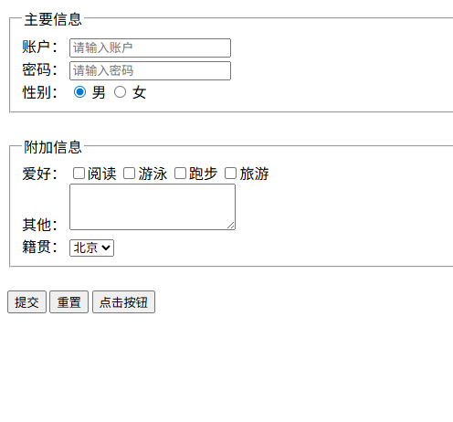
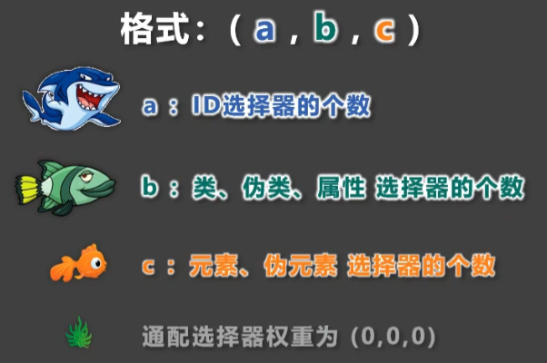
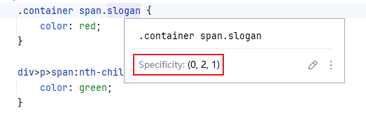
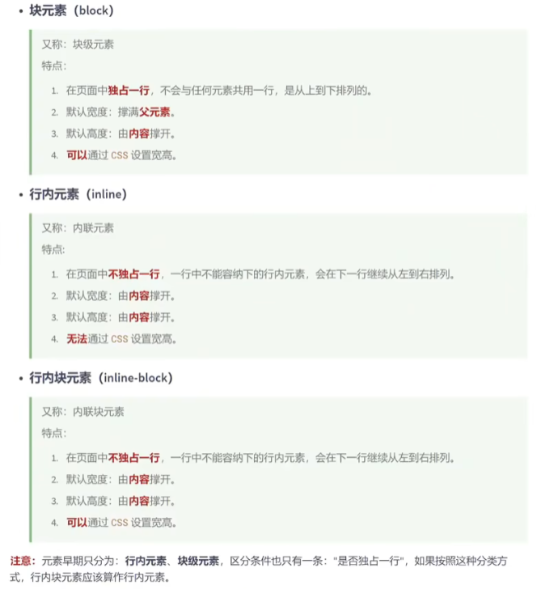
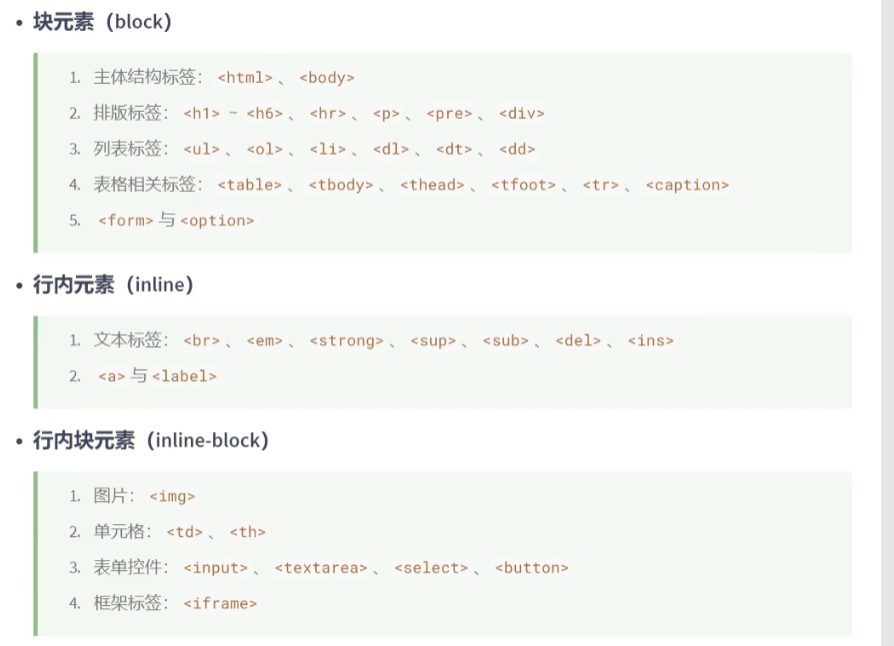
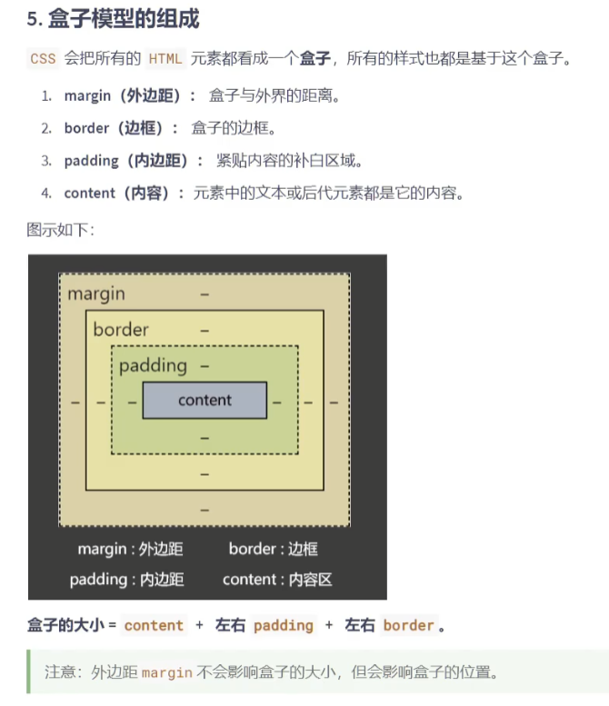
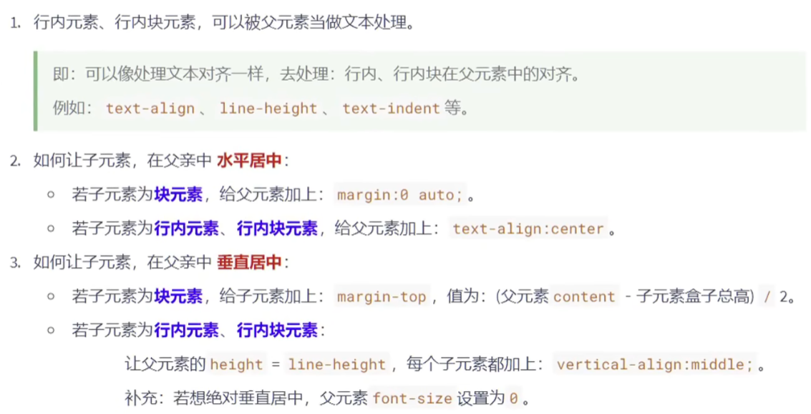
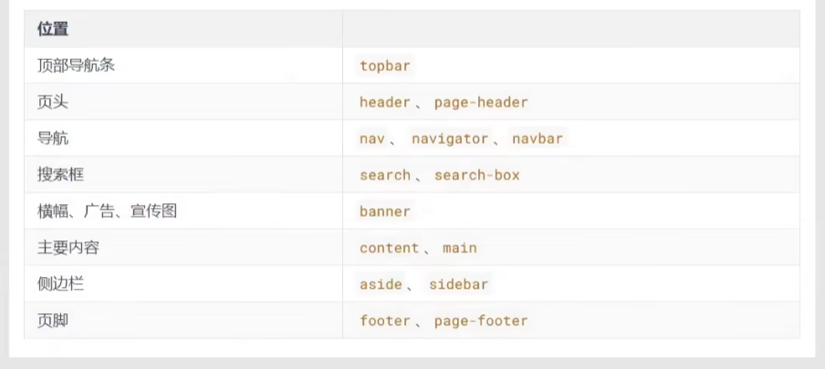
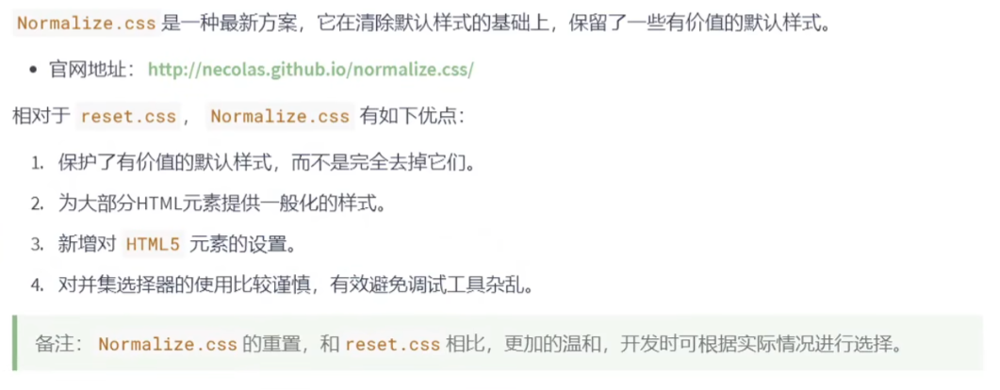

# 我的前端学习笔记


## HTML4

HTML标签参考文档：[官方文档](https://html.spec.whatwg.org/multipage/#toc-semantics) 、[w3school](https://www.w3school.com.cn/) 、[MDN](https://developer.mozilla.org/zh-CN/docs/Web/HTML)

**fieldset**标签与**legend**标签：

```html
<!doctype html>
<html lang="en">
<head>
    <meta charset="UTF-8">
    <title>Index</title>
</head>
<body>
<form action="http://localhost:8080/submit">
    <!--主要信息-->
    <fieldset>
        <legend>主要信息</legend>
        <label for="account">账户：</label>
        <input type="text" name="account" id="account" placeholder="请输入账户" maxlength="10">
        <br>
        <label for="password">密码：</label>
        <input type="password" name="password" id="password" placeholder="请输入密码" maxlength="6">
        <br>
        性别：
        <input type="radio" name="gender" id="male" value="male" checked>
        <label for="male">男</label>
        <input type="radio" name="gender" id="female" value="female">
        <label for="female">女</label>
    </fieldset>
    <br>
    <!--附加信息-->
    <fieldset>
        <legend>附加信息</legend>
        爱好：
        <label>
            <input type="checkbox" name="hobby" value="reading">阅读
        </label>
        <label>
            <input type="checkbox" name="hobby" value="swimming">游泳
        </label>
        <label>
            <input type="checkbox" name="hobby" value="running">跑步
        </label>
        <label>
            <input type="checkbox" name="hobby" value="traveling">旅游
        </label>
        <br>
        <label for="other"> 其他： </label>
        <textarea name="other" id="other" cols="23" rows="3"></textarea>
        <br>
        <label for="hometown">籍贯：</label>
        <select name="hometown" id="hometown">
            <option value="beijing">北京</option>
            <option value="shanghai">上海</option>
            <option value="guangzhou">广州</option>
            <option value="shenzhen">深圳</option>
        </select>
    </fieldset>
    <br>
    <input type="submit" value="提交">
    <input type="reset" value="重置">
    <input type="button" value="点击按钮">
</form>
</body>
</html>
```

效果如下




## CSS2

CSS：层叠样式表

样式表及其优先级：行内样式 <span style="color:red;">**>**</span> 内部样式 <span style="color:red;">**=**</span> 外部样式

### 选择器

#### 基本选择器

```css
/*通配选择器*/
* {}

/*元素选择器*/
div {}

/*类选择器*/
.class {}

/*id选择器*/
#id {}
```

#### 复合选择器

```css
/*交集选择器*/
p.beauty {
    color: red;
}

/*并集选择器*/
.dog, .pig, #susie {
    color: orange;
}

/*后代选择器*/
ul li {
    color: red;
}

/*子元素选择器*/
div > a {
    color: green;
}

/*相邻兄弟选择器*/
span + p {
    font-size: 20px;
}

/*通用兄弟选择器*/
span ~ p {
    color: red;
}

/*属性选择器*/
[title] { /*含title属性的元素*/
    font-size: 40px;
}
[title="stone1"] { /*含title属性且值为stone1的元素*/
    background-color: pink;
}
[title^="stone"] { /*含title属性且值以stone开头的元素*/
    color: blue;
}
[title$="2"] { /*含title属性且值以2结尾的元素*/
    color: green;
}
[title*="pstone"] { /*含title属性且值包含pstone的元素*/
    color: red;
}
```

#### 伪类选择器

```css
/*选中未被访问过的a元素*/
a:link {
    font-size: 20px;
    color: orange;
}

/*选中已被访问过的a元素*/
a:visited {
    color: gray;
}
```

**动态伪类**

```css
/*选中鼠标悬停的a元素*/
a:hover {
    color: skyblue;
}

/*选中鼠标点击的a元素*/
a:active {
    color: green;
}

/*获取焦点元素*/
input:focus, select:focus {
    color: orange;
    background-color: green;
}
```

<span style="color:red;">上面四个动态伪类的书写顺序：**link** > **visited** > **hover** > **active**</span>

**结构伪类**

<span style="color:red;">重点6个伪类选择器</span>

```css
div > p:first-child {}
div > p:last-child {}
div > p:nth-child(2n) {}

div > p:first-of-type {}
div > p:last-of-type {}
div > p:nth-of-type(2n+1) {}
```

其他伪类

```css
div > p:nth-last-child(2n) {}
div > p:nth-last-of-type(2n+1) {}

span:only-child {}
span:only-of-type {}

:root {}
div:empty {}
```

**否定伪类**

```css
div > p:not(.fail) {}
div > p:not([title^="你要"]) {}
div > p:not(:first-child) {}
```

**UI伪类**

```css
input:checked {}
input:enabled {}
input:disabled {}
```

**目标伪类**

```css
div:target {}
```

**语言伪类**

```css
div:lang(en) {}
div:lang(zh-CN) {}
:lang(zh-CN) {}
```

#### 伪元素选择器

```css
div::first-latter {}
div::first-line {}
div::selection {}
input::placeholder {}
p::before { content: "$" }
p::after { content: "美元" }
```

#### 选择器优先级

<b style="color:red;">行内样式 > ID选择器 > 类选择器 > 元素选择器 > 通配选择器</b>

<b style="color:orange;">组合选择器的权重计算方式：</b>



通过WebStorm查看组合选择器的权重：



<span style="color:purple;">关键字`!important`可以将属性的优先级提到最前面！！！</span>

```css
.slogan {
    color: darkred !important;
}
```


### CSS三大特性

**层叠性**：如果发生了样式冲突，那就会根据一定的规则（选择器优先级），进行样式的层叠（覆盖）。

> 样式冲突：元素的同一个样式名，被设置了不同的值，这就是冲突

**继承性**：元素会自动拥有其父元素、或其祖先元素上所设置的某些样式。

> 规则：就近原则
>
> 常见的可继承属性：text-?? 、line-?? 、color ......
>
> 备注：在MDN网站，可以查询属性是否可以被继承

**优先级**：`!important` > 行内样式 > ID选择器 > 类选择器 > 元素选择器 > `*` >  继承的样式

>需要计算权重，并集选择器的每一个部分都是分开算的


### 常用CSS属性

#### 字体属性

```css
span {
    /*Chrome浏览器默认支持的最小文字大小为12px，默认的文字大小为16px，并且0px的文字会自动消失*/
    font-size: 40px;
    /*字体族*/
    font-family: "微软雅黑";
    /*控制字体是否倾斜*/
    font-style: normal;
    /*控制字体粗细*/
    font-weight: normal;
    
    /*字体的复合属性*/
    font: italic bold 20px 'Times New Roman';
}
```

#### 文本属性

```css
div {
    color: yellow;
    background-color: purple;
    /*控制字符间距*/
    letter-spacing: 10px;
    /*控制单词间距（对中文词汇不生效）*/
    word-spacing: 20px;
    /*下划线*/
    text-decoration: underline wavy red;
    /*首行缩进2字符*/
    text-indent: 2em;
    /*文本居中*/
    text-align: center;
    /*设置文本行高
    注意事项：
    1.line-height不宜过小，一般是font-size的1.5-2倍
    2.line-height是可以继承的
    3.line-height与height的关系：若没设置height，则height=line-height*行数
    应用场景：
    1.让单行文本垂直居中
    2.调整多行文字的间距
    */
    line-height: 100px;
    /*vertical-align属性：用于控制元素在行内的垂直对齐方式（可以控制表格单元格内容的垂直对齐）*/
    vertical-align: middle;
}
```

#### 列表属性

```css
ul {
    /*去除列表项前面的符号*/
    list-style-type: disc;
    /*设置列表项的“项目符号”是放在列表项内容的“内部”还是“外部”*/
    list-style-position: outside;
    /*设置列表项的“项目符号”的样式*/
    list-style-image: url("images/1.png");
    /*复合属性*/
    list-style: url("images/1.png") inside;
}
```

#### 表格属性

```css
table {
    border-width: 2px;
    border-style: solid;
    border-color: red;
    /*边框复合属性*/
    border: 2px solid red;
    /*控制表格的列宽*/
    table-layout: auto;
    /*控制单元格间距（生效的前提是：不能合并边框）*/
    border-spacing: 2px;
    /*控制单元格边框合并*/
    border-collapse: collapse;
    /*隐藏没有内容的单元格（生效的前提是：不能合并边框）*/
    empty-cells: hide;
    /*设置表格标题的位置*/
    caption-side: bottom;
}
```

#### 背景属性

```css
div {
    /*背景色*/
    background-color: transparent;
    /*背景图片*/
    background-image: url("images/1.jpg");
    /*背景图片是否重复*/
    background-repeat: no-repeat;
    /*背景图片位置*/
    background-position: center top;
    /*复合属性*/
    background: transparent url("images/1.jpg") no-repeat center top 100% 100% fixed border-box padding-box;
}
```

#### 鼠标属性

```css
div {
    /*鼠标样式*/
    cursor: pointer;
    /*自定义鼠标图标*/
    cursor: url("images/1.png"), pointer;
}
```


### 常用的长度单位

```css
div {
    width: 200px;
    height: 200px;
    font-size: 20px;
    background-color: skyblue;
    /*px*/
    /*em：相当于当前元素的font-size的倍数（当前元素没有font-size时，以其父元素为准）*/
    /*rem：相当于根元素的font-size的倍数*/
    /*%：相对其父元素的百分比*/
}
```


### 元素的显示模式



---



**如何修改元素的显示模式？**

```css
.class {
    display: block;
    display: inline-block;
    display: inline;
    display: none;
}
```


### ★盒子模型

盒子模型的组成部分



#### 内容区

```css
div {
    background-color: skyblue;
    height: 200px;
    width: 200px;
    /*设置内容区域的最小宽度*/
    min-width: 600px;
    /*设置内容区域的最大宽度*/
    max-width: 1000px;
    /*设置内容区域的最小高度*/
    min-height: 50px;
    /*设置内容区域的最大高度*/
    max-height: 400px;
}
```

<span style="color:red;">关于默认宽度：</span>所谓的默认宽度，就是<span style="color:red;">不设置width属性时</span>，元素所呈现出来的宽度。

<b style="color:blue;">盒子总宽度 = 父的`content` - 自身的左右`margin`</b>。

<b style="color:purple;">内容区的宽度 = 父的`content` - 自身的左右`margin` - 自身的左右border - 自身的左右`padding`</b>。


#### 内边距

```css
div {
    width: 400px;
    height: 400px;
    background-color: lightblue;
    font-size: 20px;
    /*单侧内边距*/
    padding-left: 10px;
    padding-right: 20px;
    padding-top: 30px;
    padding-bottom: 40px;
    /*
    复合属性
    写一个值含义：四个方向的内边距一样
    写两个值含义：上下、左右
    写三个值含义：上、左右、下
    写四个值含义：上、右、下、左
    */
    padding: 20px;
    padding: 30px 20px 40px 10px;

}

/*对于行内元素，其左右内边距设置没有问题，上下内边距不能完美设置（会凸出遮挡上下行）*/
/*块级元素、行内块元素，四个方向的内边距都可以完美设置*/
span {
    background-color: orange;
    padding: 20px;
}
```


#### 边框

```css
div {
    width: 400px;
    height: 400px;
    background-color: skyblue;

    /* 边框宽度 */
    border-width: 10px;
    border-top-width: 10px;
    border-right-width: 20px;
    border-bottom-width: 30px;
    border-left-width: 40px;

    /* 边框颜色 */
    border-color: red;
    border-top-color: red;
    border-right-color: green;
    border-bottom-color: blue;
    border-left-color: yellow;


    /* 边框样式 */
    border-style: solid;
    border-top-style: solid;
    border-right-style: dashed;
    border-bottom-style: dotted;
    border-left-style: double;

    /*复合属性*/
    border: 10px solid red;
    border-left: 1px solid red;
    border-right: 2px dotted green;
    border-bottom: 3px double blue;
    border-top: 4px dashed yellow;
}
```


#### 外边距

```css
div {
    width: 400px;
    height: 400px;
    background-color: skyblue;

    /* 设置外边距 */
    margin: 20px;
    margin: 10px 20px;
    margin: 10px 20px 30px;
    margin: 10px 20px 30px 40px;

    margin-left: 10px;
    margin-top: 20px;
    margin-right: 30px;
    margin-bottom: 40px;
}
```

<span style="color:red;">注意事项：</span>

1、子元素的margin是参考父元素的content区域来计算的

2、margin-top和margin-left会影响到元素的位置，而margin-right和margin-bottom会影响到右边元素和下方元素的位置

3、对于行内元素来说，左右的margin是可以完美设置的，上下的margin设置后是无效的

4、margin的值可以设为auto，给一个块级元素左右margin设置auto，则该元素会在其父元素内水平居中

5、margin的值可以设置为负值


<span style="color:red;">margin塌陷问题：第一个子元素的上margin会作用在父元素上，最后一个子元素的下margin会作用在父元素上。</span>

解决方案如下：给父元素添加如下属性

```css
outer {
    /*解决方案一：给父元素设置不为0的padding*/
    border: 1px solid red;
    /*解决方案二：给父元素设置宽度不为0的border*/
    padding: 1px;
    /*解决方案三：给父元素设置css样式 overflow: hidden*/
    overflow: hidden;
}
```


<span style="color:red;">margin合并问题：上下排列的兄弟元素，上面兄弟元素的下边距和下面兄弟元素的上边距会合并，取最大值，而非相加</span>

没有完美解决方案，只能规避：在布局上下排列的兄弟元素时，只单方面设置一个元素的边距即可。


#### 处理内容的溢出

```css
div {
    width: 400px;
    height: 200px;
    background-color: skyblue;
    overflow: visible;
    /*overflow: scroll;*/
    /*overflow: hidden;*/
    /*overflow: auto;*/
    overflow-x: auto;
    overflow-y: auto;
}
```


#### 隐藏元素的方式

方式一：visibility属性

默认值是`show`，如果设置为`hidden`，元素会被隐藏，但是元素还占有原来的位置（元素的大小依然保持）。

方式二：display属性

设置`display: none`，就可以让元素隐藏。彻底地隐藏，不但看不见，也不占用任何位置，没有大小宽高。

```css
.box {
    width: 200px;
    height: 200px;
}

.box1 {
    background-color: skyblue;
    display: none;
    visibility: hidden;
}

.box2 {
    background-color: orange;
}
```


#### 样式的继承

```css
#d1 {
    height: 600px;
    padding: 50px;
    background-color: gray;
    /*继承样式*/
    font-size: 30px;
    color: red;
    font-weight: bold;
}

#d2 {
    height: 400px;
    padding: 50px;
    background-color: pink;
}

#d3 {
    height: 200px;
    background-color: yellow;
    /*font-size: 30px;*/
    /*color: red;*/
    /*font-weight: bold;*/
}
```

<span style="color:red;">会继承的css属性</span>：字体属性、文本属性（除了vertical-align）、文字颜色等。<span style="color:red;">一个规律：能继承的属性，都是不影响布局的，简单说：都是与盒子模型无关的。</span>

<span style="color:blue;">不会继承的css属性</span>：边框、背景、内边距、外边距、宽高、溢出方式等。


#### 布局技巧

```css
/*布局一：块级子元素水平、垂直居中*/
.outer {
    width: 400px;
    height: 400px;
    background-color: gray;
    overflow: hidden;
}

.inner {
    width: 200px;
    height: 100px;
    background-color: orange;
    margin: 150px auto 0;
}

/*布局二：行内子元素水平、垂直居中*/
#d1 {
    width: 400px;
    height: 400px;
    background-color: gray;
    text-align: center;
    line-height: 400px;
}

#d1 span {
    background-color: orange;
    font-size: 20px;
}

/*布局三：行内子元素与行内块级子元素水平、垂直居中*/
#d2 {
    width: 400px;
    height: 400px;
    background-color: gray;
    text-align: center;
    line-height: 400px;
    font-size: 0;
}

#d2 span {
    background-color: orange;
    font-size: 20px;
    vertical-align: middle;
}

#d2 img {
    width: 100px;
    vertical-align: middle;
}
```

**布局小技巧**




**元素之间的空白问题**

```css
div {
    height: 400px;
    background-color: gray;
    /*通过设置父元素的font-size为0来解决元素之间的空白问题*/
    font-size: 0;
}

span {
    font-size: 20px;
}
```

**问题的原因**：行内元素、行内块元素，彼此之间的换行会被浏览器解析为一个空白字符。

**解决方案**：

1、去掉换行和空格（不推荐）。

2、给父元素设置`font-size`，再给需要显示文字的元素，单独设置字体大小（推荐）。


**行内块元素之间的幽灵空白问题**

```css
div {
    width: 600px;
    background-color: skyblue;
    /*解决方案三*/
    font-size: 0;
}

img {
    height: 200px;
    /*解决方案一（最佳）：除baseline以外的任意值*/
    /*vertical-align: bottom;*/
    /*解决方案二*/
    display: block;
}
```

**问题的原因**：行内块元素与文本的基线对齐，而文本的基线与文本最底端之间是有一定距离的。

**解决方案**：

1、给行内块设置`vertical-align`，值不为`baseline`即可，设置为`middle`、`bottom`、`top`均可。

2、若父元素中只有一张图片，设置图片为`display: block`。

3、给父元素设置`font-size: 0`，如果该行内块内部还有文本，则需单独设置`font-size`。


### ★浮动

最初，浮动是用来实现文字环绕图片效果的，现在浮动是最主流的页面布局方式之一。

<span style="color:red;">元素浮动后的特点</span>：

1.脱离文档流，浮动元素不再按照标准文档流的布局排版

2.不管是块级元素还是行内元素，浮动后默认宽高都是由内容撑开（尽可能小），可以自定义设置

3.浮动元素不会独占一行，可以与其他元素共用一行

4.不会margin合并，也不会margin塌陷，能够完美设置四个方向的margin和padding

5.不会像行内块一样被当做文本处理（没有行内块的空白问题）


<span style="color:red;">元素浮动后产生的影响，及解决方案</span>：

影响：

1.对兄弟元素的影响：后面的兄弟元素，会占据浮动元素原理的位置，在浮动元素的下面；对前面的兄弟元素无影响。

2.对父元素的影响：不能撑起父元素的高度，导致父元素高度塌陷；但父元素的宽度依然束缚浮动的元素。

解决方案：

方案一：给父元素指定高度。

方案二：给父元素也设置浮动，带来其他影响。

方案三：给父元素设置`overflow: hidden`。

方案四：在所有浮动元素的最后面，添加一个块级元素，并给它设置`clear: both`。

方案五：给浮动元素的父元素，设置伪元素，通过伪元素清除浮动，原理与方案四相同（推荐使用）

```css
.parent::after {
    content: "";
    display: block;
    clear: both;
}
```

<span style="color:red;">布局中的一个原则：设置浮动的时候，兄弟元素要么全都浮动，要么全都不浮动。</span>


### 定位

#### 相对定位

**如何设置相对定位**？

- 给元素设置`position: relative`即可实现相对定位。
- 可以使用`left`、`right`、`top`、`bottom`四个属性调整位置

**相对定位的参考点在哪里**？

- 相对自己原来的位置

**相对定位的特点**：

1. 不会脱离文档流，元素位置的变化，只是视觉效果上的变化，不会对其他元素产生任何影响。

2. 定位元素的显示**层级**比普通元素高，无论什么定位，显示层级都是一样的。

    默认规则是：

    - 定位的元素会覆盖在普通元素之上
    - 都发生定位的两个元素，后写的元素会盖在先写的元素之上。

3. `left`和`right`不能同时设置，`top`和`bottom`不能同时设置。

4. 相对定位的元素，也能继续浮动，但不推荐这样做。

5. 相对定位的元素，也能通过`margin`调整位置，但不推荐这样做。

> 注意：绝大多数情况下，相对定位会与绝对定位配合使用。


#### 绝对定位

**如何设置绝对定位**？

- 给元素设置`position: absolute`即可实现绝对定位。
- 可以使用`left`、`right`、`top`、`bottom`四个属性调整位置。

**绝对定位的参考点在哪里**？

- 参考它的<b style="color:red;">包含块</b>

> 什么是包含块？
>
> 1. 对于没有脱离文档流的元素，其父元素就是它的包含块；
> 2. 对于脱离文档流的元素，第一个开启定位的祖先元素，就是它的包含块（如果所有祖先都没有定位，那么包含块就是整个页面）

**绝对定位元素的特点**：

1. 脱离文档流，会对后面的兄弟元素、父元素有影响。
2. `left`和`right`不能同时设置，`top`和`bottom`不能同时设置。
3. 绝对定位、浮动不能同时设置，如果同时设置，浮动就会失效，以绝对定位为主。
4. 开启绝对定位的元素，依然可以通过`margin`调整位置，但是不推荐这样做。
5. <span style="color:red;">无论是什么元素（行内、块级、行内块）设置为绝对定位后，都变成了定位元素</span>

> 何为定位元素？——默认宽、高都被内容所撑开，且能自由设置宽高。


#### 固定定位

**如何设置固定定位**？

- 给元素设置`position: fixed`即可实现固定定位。
- 可以使用`left`、`right`、`top`、`bottom`四个属性调整位置。

**固定定位的参考点在哪里**？

- 参考它的<b style="color:red;">视口</b>

> 什么是视口？——对于PC浏览器来说，视口就是我们看网页的窗口。

**固定定位元素的特点**：

1. 脱离文档流，会对后面的兄弟元素、父元素有影响。
2. `left`和`right`不能同时设置，`top`和`bottom`不能同时设置。
3. 固定定位和浮动不能同时设置，如果同时设置，浮动就会失效，以固定定位为主。
4. 固定定位的元素，也可以通过`margin`调整位置，但不推荐这样做。
5. <span style="color:red;">无论是什么元素（行内、块级、行内块）设置为固定定位后，都变成了定位元素</span>


#### 粘性定位

**如何设置粘性定位**？

- 给元素设置`position: sticky`即可实现粘性定位
- 可以使用`left`、`right`、`top`、`bottom`四个属性调整位置，不过最常用的是`top`值

**粘性定位的参考点在哪里**？

- 离它最近的一个拥有"滚动机制"的祖先元素，即便这个祖先元素不是最近的真实可滚动祖先（内容不需要滚动的元素，可以通过`overflow: scroll`设置空滚动，这种空滚动就叫非真实可滚动）

**粘性定位元素的特点**

- <span style="color:red;">不会脱离文档流</span>，它是一种专门用于窗口滚动时的新的定位方式
- 最常用的值是`top`值
- 粘性定位和浮动可以同时设置，但不推荐这样做
- 粘性定位的元素，也能通过`margin`调整位置，但不推荐这样做

> 粘性定位和相对定位的特点基本一致，不同的是：粘性定位可以在元素到达某个位置时将其固定


#### 定位的层级

1. 定位元素的显示层级比普通元素高，无论什么定位，显示层级都是一样高的
2. 如果位置发生重叠，默认情况是后面的元素会覆盖在前面的元素之上
3. 可以通过css属性`z-index`调整元素的显示层级
4. `z-index`的属性值是纯数字，没有单位，值越大显示层级越高
5. 只有定位的元素设置`z-index`才有效
6. 如果`z-index`值大的元素，依然没有覆盖掉值小的元素，可以检查其包含块的层级


#### 定位的特殊应用

> 注意：
>
> 1. 发生固定定位、绝对定位后，元素都变成了定位元素，默认宽高都是由内容撑开，且依然可以设置宽高
> 2. 发生相对定位后，元素依然是之前的显示模式
> 3. 以下所说的特殊应用，只针对**绝对定位**和**固定定位**的元素，不包括相对定位的元素

**一、让定位元素的宽度充满包含块**

1. 宽度想充满包含块，可以给定位元素同时设置`left: 0`和`right: 0`
2. 高度想充满包含块，可以给定位元素同时设置`top: 0`和`bottom: 0`

```css
.outer {
    height: 400px;
    background-color: #888;
    position: relative;
}

.inner {
    background-color: orange;
    font-size: 20px;
    padding: 20px;
    border: 10px solid black;
    /*让子元素高度与宽度恰好填满父元素content区域*/
    position: absolute;
    left: 0;
    right: 0;
    top: 0;
    bottom: 0;
}
```


**二、让定位元素在包含块中居中**

```css
.outer {
    width: 800px;
    height: 400px;
    background-color: #888;
    position: relative;
}

.inner {
    width: 400px;
    height: 100px;
    background-color: orange;
    font-size: 20px;
    position: absolute;
    /*在包含块内水平垂直居中*/
    /*方案一（推荐）*/
    left: 0;
    right: 0;
    top: 0;
    bottom: 0;
    margin: auto;
    /*方案二（不推荐）*/
    /*left: 50%;*/
    /*top: 50%;*/
    /*水平居中*/
    /*margin-left: -200px;*/
    /*垂直居中*/
    /*margin-top: -50px;*/
}
```


### 布局

#### 版心

在PC端网页中，一般都会有一个固定宽度且水平居中的盒子，来显示网页的主要内容，这就是网页的<b style="color:red;">版心</b>。

版心的宽度一般是`960`~`1200`像素之间，版心可以是一个，也可以是多个（推荐）。

通过设置版心，网页可以照顾到市面上大多数主流尺寸的显示器的布局显示不被打乱。


#### 常用类名




#### 重置默认样式

方案一：全局选择器（实际开发中不推荐使用）

```css
* {
    margin: 0;
    padding: 0;
    ......
}
```


方案二：reset.css

选择到具有默认样式的元素，清空其默认样式。

> 经过reset后的网页，好似“一张白纸”，开发人员可以根据设计稿，精细的去添加具体的样式


方案三：Normalize.css




### 实战案例


https://www.bilibili.com/video/BV1p84y1P7Z5?spm_id_from=333.788.player.switch&vd_source=71b23ebd2cd9db8c137e17cdd381c618&p=148

## HTML5


## CSS3


# END
